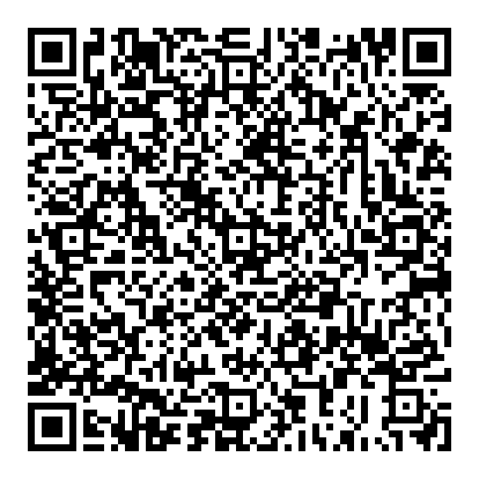

# Open Standard Serialization Format for FDA Nutrition Label

The [probably needs a nifty name] serialization format for nutrition labels describes an
encoding scheme to reduce the information found on any nutrition label into fewer bytes
that can be easily encoded into a QR code or data matrix.

## Why?

Most apps for dietary tracking use large and mostly user-submitted databases to look up
nutrition information. This naturally leads to network effects that prohibit businesses from
innovating new apps and services. The end goal of a QR encoding format would be to have a
readily available standard for FDA label requirements that would break up these network
effects and provide easy access to food information for consumers using all manner or tools,
and without having to buy into a particular ecosystem. Encoding the nutrition label on the
package directly removes the need for large dietary information databases. This approach is much
more consumer friendly, and lowers the barrier to smaller business offerings.

## Overview

Very simply, any of the common entries on an FDA nutrition label should be keyed in a readily
computer-consumable format such as JSON and then encoded to a smaller binary format for actual
storage in a QR code. Why JSON? There are requirements for information found on a label, but there
is also voluntary information that may or may not appear on the label. JSON parsers work well
with this format of keys that may not be included. It is technically not necessary for the
intermediate step of a JSON key, but the intent was for ease of use from a development standpoint,
even though a user does not see this information step. This means that the JSON keys should be
well defined from the common language fields of the actual label.

## Format

### Common Language Key

This table is the only information that an application would need to look up in order to display
to the user a nicely readable nutrition label. As such, it should be as comprehensive as possible.

| Key | Value |
| --- | ---: |
| servings per container | srvs |
| serving information | srv |
| serving unit label | srvu |
| units per serving | qty |
| fractional denominator | d |
| fractional numerator | n |
| grams | g |
| milligrams | mg |
| micrograms | mcg |
| percent daily value | dv |
| total fat | tf |
| saturated fat | sf |
| cholesterol | ch |
| sodium | na |
| total carbohydrate | cb |
| dietary fiber | fb |
| total sugars | sg |
| includes added sugars | asg |
| protein | pt |
| vitamin d | vd |
| calcium | ca |
| iron | fe |
| potassium | k |
| vitamin a | va |
| vitamin c | vc |
| thiamin | th |
| riboflavin | rb |
| niacin | ni |
| vitamin b6 | vb6 |

The same table in a more programmatic format [here](clk-en.json). Note that the common language
key is versioned.

### JSON Key Format

In this format, `srvs`, `srv`, `tf`, `sf`, `ch`, `na`, `cb`, `fb`, `sg`, `pt`, `vd`, `ca`, `fe`,
`k`, `va`, `vc`, `th`, `rb`, `ni`, and `vb6` are keys of the main JSON object. Only `srvs`,
representing "Servings Per Container", is a key-value pair, and not a nested object. The `srv`,
or "Serving Information" object contains the key-value pairs for the servings unit label, `srvu`,
the amount of units per serving, `qty`, and the mass of the serving in grams, `g`. To use a
fractional quantity, `qty` can be an object with keys `n` and `d`.

Each of the nutrition objects contains any or all of the keys for mass (`g`, `mg`, or `mcg`),
and Percent Daily Value, `dv`. A non-required field missing is also fine, as well as the use of
zero and null, e.g. `{"ni": null}`. However, not including a field will result in the smallest
bit size.

Example label key:

```json
{
	"srvs": 1,
	"srv": {
		"srvu":  "box",
		"qty": 1,
		"g":   85
	},
	"tf": {"g":  1.5, "dv": 4},
	"sf": {"g":  0.5, "dv": 5},
	"ch": {"mg": 10,  "dv": 3},
	"na": {"mg": 240, "dv": 16},
	"cb": {"g":  11,  "dv": 7},
	"fb": {"g":  1,   "dv": 7},
	"sg": {"g":  1,   "dv": 4},
	"pt": {"g":  3,   "dv": 23},
	"vd":  {"mcg": 2,   "dv": 10},
	"ca":  {"mg":  0,   "dv": 0},
	"fe":  {"mg":  2,   "dv": 10},
	"k":   {"mg":  120, "dv": 2},
	"va":  {"dv":  0},
	"vc":  {"dv":  0},
	"th":  {"dv":  35},
	"rb":  {"dv":  30},
	"ni":  {"dv":  30},
	"vb6": {"dv":  30}
}
```

### Binary Encoding

The whitespace-stripped JSON is then reduced to a
[Smile](https://github.com/FasterXML/smile-format-specification) binary data format stream.
The choice of Smile is for similar reasons to using JSON, as the data included can be dynamic,
even though using a custom schema for encoding the keys into bytes would produce a smaller size.
It would likely be more rigid in its requirements. The above label key example is reduced from 395
bytes to 215 bytes, which is small enough for a QR code or data matrix of reasonable size.

Example key QR:


